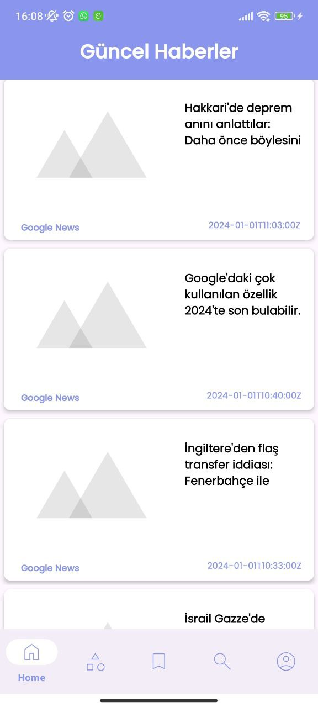
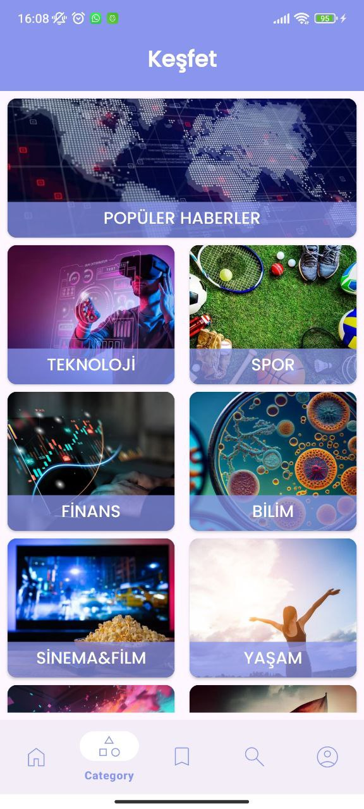
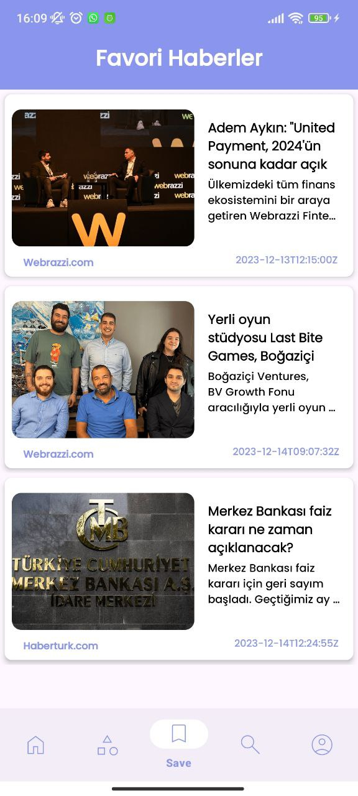
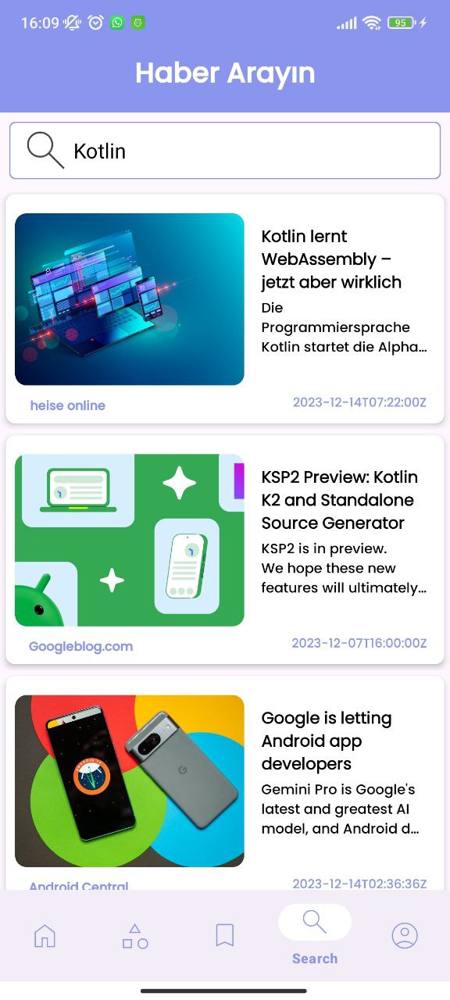
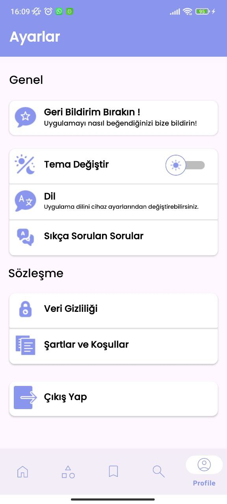
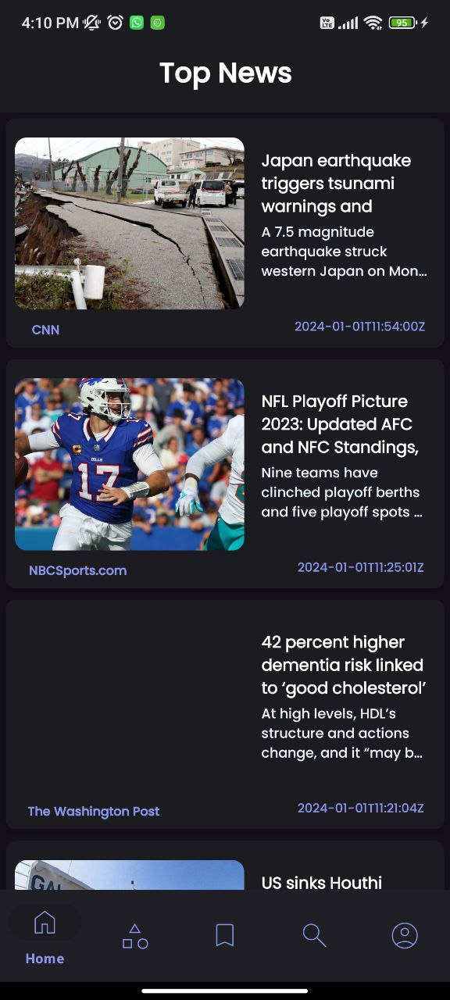
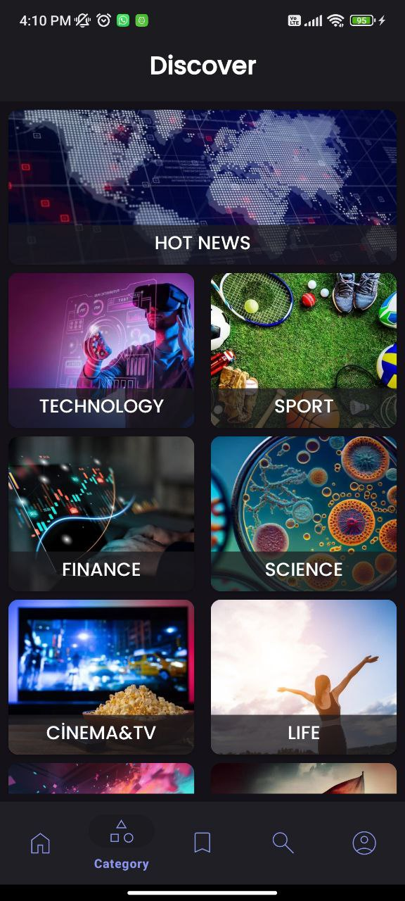
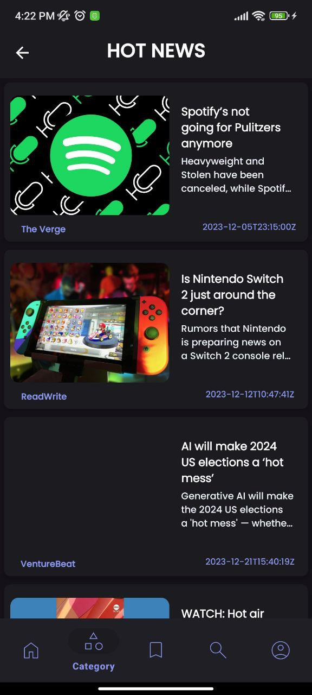
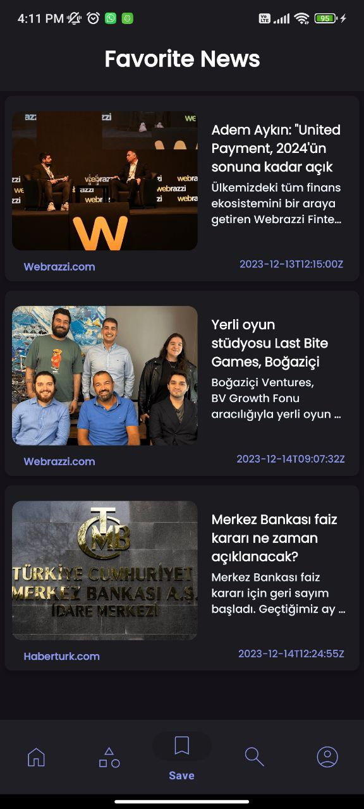
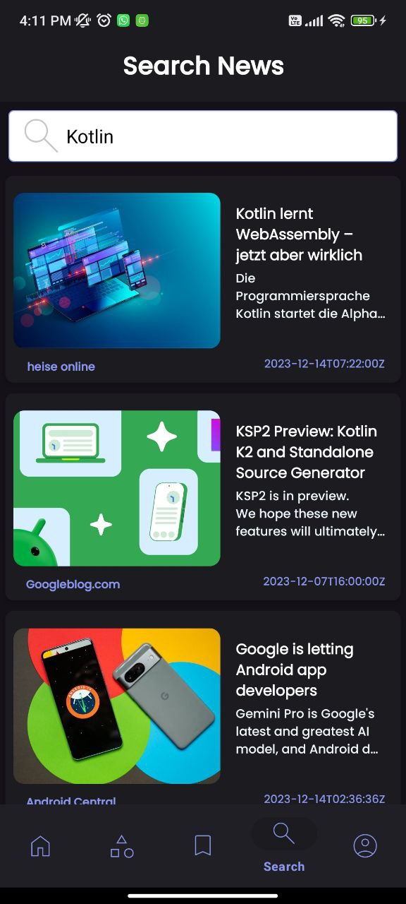

<h1 align="center">RNEWS</h1></br>
<p align="center">
  RNEWS is a news application where you can read current news, save news and search for news.
</p>


<p align="center">
  <a href="https://opensource.org/licenses/Apache-2.0"></a>
  <a href="https://android-arsenal.com/api?level=23"></a>
  <a href="https://github.com/recepbrk"></a> 
</p>

### Screenshots
### Light Version
| Splash Screen | Home Screen | News Details Screen | Category Screen | 
| ------------- | ------------- | ------------- | ------------- |
|  |  |  |  |

| Category Details Screen | Save Screen | Search Screen | Settings Screen |
| ------------- | ------------- | ------------- | ------------- |
|  |  |  | 


**[Other Screenshots](Screenshoots)**

</div>

### Dark Version
| Splash Screen | Home Screen | News Details Screen | Category Screen |
| ------------- | ------------- | ------------- | ------------- |
|  |  |  |  |

| Category Details Screen | Save Screen | Search Screen | Settings Screen |
| ------------- | ------------- | ------------- | ------------- |
|  |  |  | 


**[Other Screenshots](Screenshoots)**

</div>

## Tech stack & Open-source libraries
- My application supports 2 languages: English and Turkish.
- [Kotlin](https://kotlinlang.org/), [Coroutines](https://github.com/Kotlin/kotlinx.coroutines) and [LiveData](https://developer.android.com/topic/libraries/architecture/livedata)
- Clean Architecture
- [Navigation Component](https://developer.android.com/guide/navigation) - Single activity multiple fragments approach
- [JetPack](https://developer.android.com/jetpack)
    - [LiveData](https://developer.android.com/topic/libraries/architecture/livedata) - Observable lists.
    - [Lifecycle](https://developer.android.com/topic/libraries/architecture/lifecycle) - Dispose of observing data when lifecycle state changes.
    - [Fragment-ktx](https://developer.android.com/kotlin/ktx#fragment) - A set of Kotlin extensions that helps with fragment lifecycle.
    - [View Binding](https://developer.android.com/topic/libraries/view-binding) - Allows you to more easily write code that interacts with views
    - [Data Binding](https://developer.android.com/topic/libraries/data-binding?hl=en) - Data Binding is the process of binding data to a layout xml file.
    - [ViewModel](https://developer.android.com/topic/libraries/architecture/viewmodel) - UI related data holder, lifecycle aware.
- [Firebase](https://firebase.google.com/)
    - [Authentication](https://firebase.google.com/docs/auth?hl=tr) 
    - [Authentication -Email](https://firebase.google.com/docs/auth/android/email-link-auth?hl=tr)
    - [Authentication -Google](https://firebase.google.com/docs/auth/android/google-signin?hl=tr) 
- [Hilt](https://developer.android.com/training/dependency-injection/hilt-android) is a dependency injection library for Android
- [Room](https://developer.android.com/training/data-storage/room) persistence library provides an abstraction layer over SQLite to allow fluent database access while harnessing the full power of SQLite. 
- [Retrofit](https://square.github.io/retrofit/) A type-safe HTTP client for Android
- [Glide](https://github.com/bumptech/glide) - Glide is a fast and efficient open source media management and image loading framework for Android
- [Coil](https://github.com/coil-kt/coil) -  Coil is a fast and efficient open source media management and image loading framework for Android
- [Localization](https://developer.android.com/guide/topics/resources/localization?hl=en) -  Two language options are available in the application using Localization


## Architecture
This app uses [***MVVM (Model View View-Model)***](https://developer.android.com/jetpack/docs/guide#recommended-app-arch) architecture


## API Key 🔑

- You will need to provide a private key to retrieve data from the NEWS API.
- Generate a new key from [here](https://newsapi.org/). 

``` API_KEY = YOUR_API_KEY ```

## Find this repository useful?

- Don't forget give a star. ⭐
- You can follow me on Github 💻
-   <a href="https://github.com/recepbrk"></a> 

## Licence

```
    Designed and developed by 2024 recepbrk (Recep Güzel)

   Licensed under the Apache License, Version 2.0 (the "License");
   you may not use this file except in compliance with the License.
   You may obtain a copy of the License at

     http://www.apache.org/licenses/LICENSE-2.0

   Unless required by applicable law or agreed to in writing, software
   distributed under the License is distributed on an "AS IS" BASIS,
   WITHOUT WARRANTIES OR CONDITIONS OF ANY KIND, either express or implied.
   See the License for the specific language governing permissions and
   limitations under the License.
```
